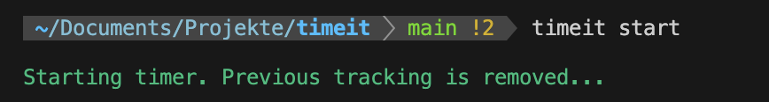
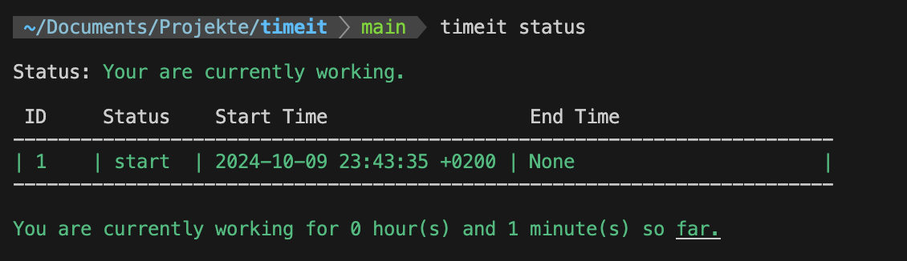
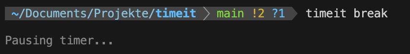
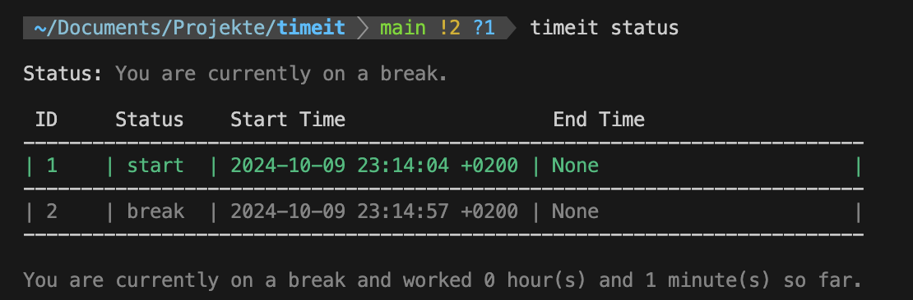
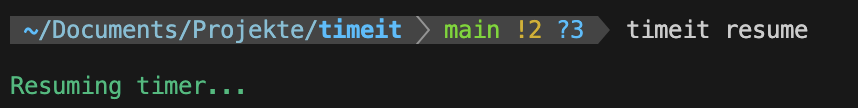
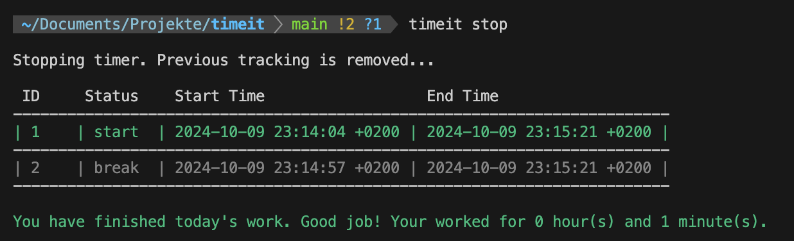

# Timeit

A simple tool written in _Rust_ for time tracking inlcuding smaller breaks throughout the day.

Are you working without a strict time management system and you have to track your working hours yourself and need to note them down somewhere? Yes? Then **Timeit** maybe a suitable tool for you. Without fancy web tools or heavy code-base the CLI tool helps you track your time with considering breaks you are doing throughout the day. This tool is not for tracking time for different projects but rather a general time tracking tool that gives you your working time which you can note down somewhere. As simple as that!

## Installation

Go to the folder of your choice and clone this repo with `git clone git@github.com:jasperschalla/timeit.git .`.

Build the project by running `cargo build --release`. Cargo should already be installed at this point.

Add the path of the release version to your .bashrc (or .zshrc) file by running `echo 'export PATH="<your_project_directory>/target/release:$PATH"' >> ~/.bashrc`.

Now you can run `timeit --help` to see if it works and is recognized.

## Usage

### 1. Start Time Tracking

The command `timeit start` starts the time tracking.

The status of your currently running tracking can be seen with `timeit status`.

### 2. Start Break

When you start a break you can register that by running `timeit break`.

You can also get the status while being on a break.

### 3. Resume Time Tracking

You can resume your time tracking by running `timeit resume`.

### 4. Stop Time Tracking

You can stop the time tracking and getting back the work hours by running `timeit stop`.

